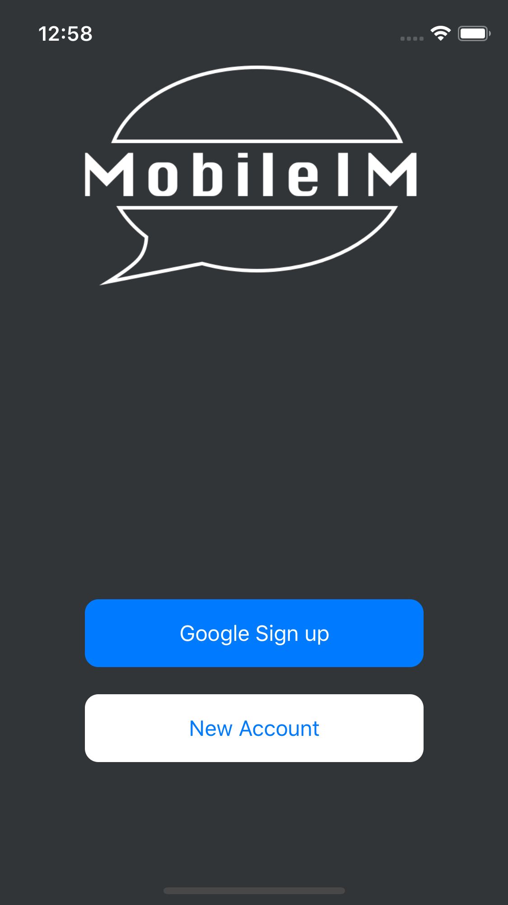

# MobileIM - Mobile Instant Messanger

## Description

This is a messagner using Google oAuth to sign in. Allows anyone to jump into this global chat room and charm in.

## Getting Started

### Dependencies
* __MacOS:__ 
  * iOS & Android app
* __Windows:__ 
  * Android app (only)
* React, React Native, Xcode, Android Studio, Axios, Redux, Redux-Sagas, Node, Express Server, Web Socket, and more.

### Installing

1. Clone or download repo.
2. cd into `MobileIM` folder.
3. run `yarn` to install dependencies.
4. cd into `server` folder.
5. run `yarn` to install server's dependencies.

### Executing program

1. cd into `server` folder.
2. run `nodemon` to spin up server.
3. on a new terminal window, cd into the `MobileIM` folder.
4. run `react-native run-[platform]` (platform: ios/android)

## Help

Any advise for common problems or issues please report under the `issues` tab.

## Authors

Names and contact info

[Jimmy De Los Angeles](https://www.linkedin.com/in/jimmydla/)

## License

This project is licensed under the MIT License - see the LICENSE.md file for details

## Acknowledgments

Inspiration, code snippets, etc.
* [awesome-readme](https://github.com/matiassingers/awesome-readme)